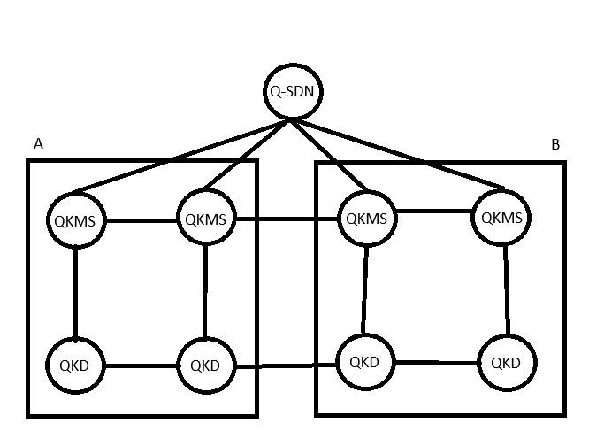

# 망 구성

# 소개
본 저장소는 다음의 목적을 가진다.

- QKMS-QKD 간 표준 통신
- QKMS-QKMS 간 통신 및 키 릴레이
- QKMS-QSDN-C 간 통신 및 제어
# 조건

- QKD는 물리장치없이 가상으로 시뮬레이션 한다.
- QKMS 로직 구현시 AI 사용을 금지한다.
- QKMS 간 통신 시 TLS(>=1.2)를 사용한다.
- 최종 테스트는 각 컴포넌트를 도커로 올려서 테스트를 진행, 제어는 콘솔로 진행한다.
- DB는 초안 완성 후 추가한다. 그 전까지 메모리에 저장하여 사용한다.
